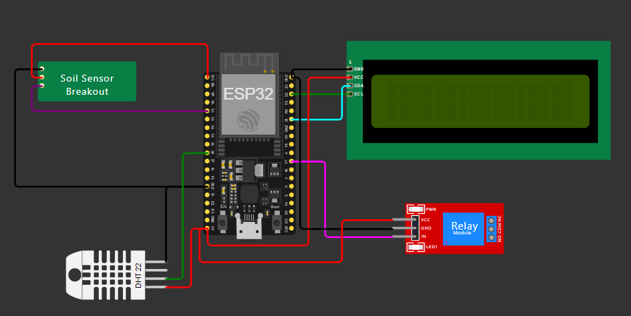

# IoT Environment Monitoring System

This project involves an IoT-based environment monitoring system using an ESP32, DHT11 sensor, soil moisture sensor, and a relay. The system reads temperature, humidity, and soil moisture levels, displays them on an LCD, and sends the data to Adafruit IO. The relay is controlled based on the soil moisture level,connected to a pump, turning on when the soil is dry and off when it is wet.

## Components Used

- ESP32
- DHT11 Temperature and Humidity Sensor
- Soil Moisture Sensor
- 16x2 I2C LCD Display
- Relay Module
- Breadboard and Jumper Wires

## Circuit Diagram



## Installation

1. **Clone the repository:**

    ```bash
    git clone https://github.com/your-username/IoT-Environment-Monitoring.git
    cd IoT-Environment-Monitoring
    ```

2. **Install necessary libraries:**

    Ensure you have the following libraries installed in your Arduino IDE:
    - `Adafruit MQTT Library`
    - `Adafruit Unified Sensor`
    - `DHT sensor library`
    - `LiquidCrystal_I2C`
    - `WiFi`

    You can install these libraries from the Library Manager in the Arduino IDE.

3. **Update WiFi and Adafruit IO credentials:**

    Open the `main.ino` file and update the following lines with your WiFi SSID, password, and Adafruit IO credentials:

    ```cpp
    const char* ssid = "your-ssid";
    const char* password = "your-password";
    #define AIO_USERNAME    "your-adafruit-io-username"
    #define AIO_KEY         "your-adafruit-io-key"
    ```

4. **Upload the code to ESP32:**

    Connect your ESP32 to your computer and upload the code using the Arduino IDE.

    

    #### <p align="center">Turn pump on when soil is dry.</p>

    

    #### <p align="center">Turn pump off when soil moisture is exceeded.</p>

## Adding Dashboard Feeds to Adafruit IO

1. **Sign in to Adafruit IO:**

    Go to [Adafruit IO](https://io.adafruit.com/) and sign in to your account.

2. **Create new feeds:**

    - Navigate to "Feeds" and click "Create a New Feed".
    - Create feeds named `Proj1_Temp`, `Proj1_Hum`, `Soil`, and `relay`.

3. **Create a new dashboard:**

    - Navigate to "Dashboards" and click "Create a New Dashboard".
    - Name your dashboard (e.g., "Environment Monitoring").

4. **Add blocks to your dashboard:**

    - Open your dashboard and click on the "+" icon to add a new block.
    - Add the following blocks:
        - **Gauge** for `Temperature` to display temperature.
        - **Gauge** for `Humidity` to display humidity.
        - **Text** for `Soil` to display soil moisture status.
        - **Toggle** for `Relay` to control the relay status.

    Configure each block to use the corresponding feed created earlier.

5. **View your dashboard:**

    Once all blocks are added and configured, you can view your dashboard to monitor the sensor data in real-time.

    
    #### <p align="center">Data Displayed Remotely</p>


## Usage

- Power on the ESP32.
- The system will connect to the WiFi and start reading sensor data.
- The data will be displayed on the LCD and sent to Adafruit IO.
- The relay will be controlled based on the soil moisture level.

## Troubleshooting

- Ensure all connections are secure and correct.
- Verify WiFi credentials and Adafruit IO credentials are correct.
- Check the serial monitor for any error messages.

## Acknowledgments

- [Adafruit IO](https://io.adafruit.com/)
